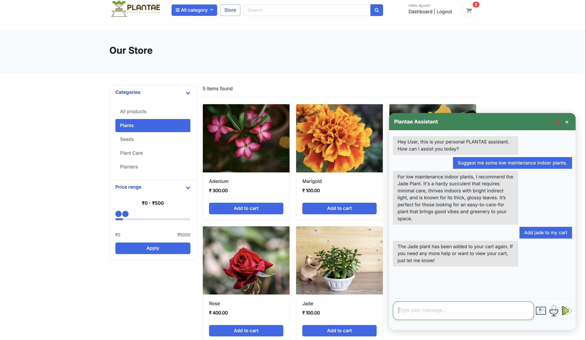
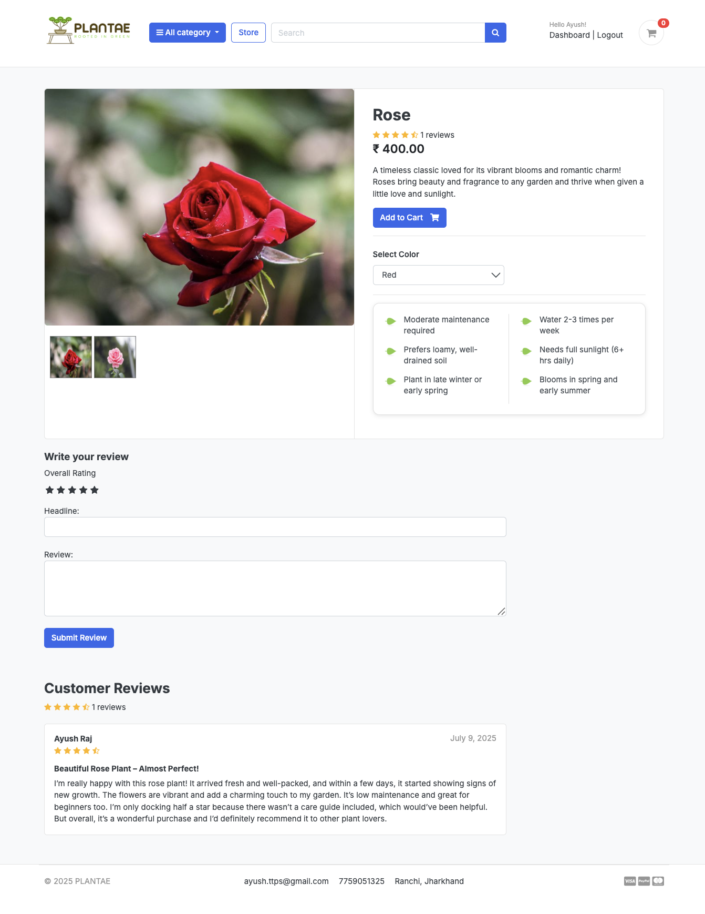
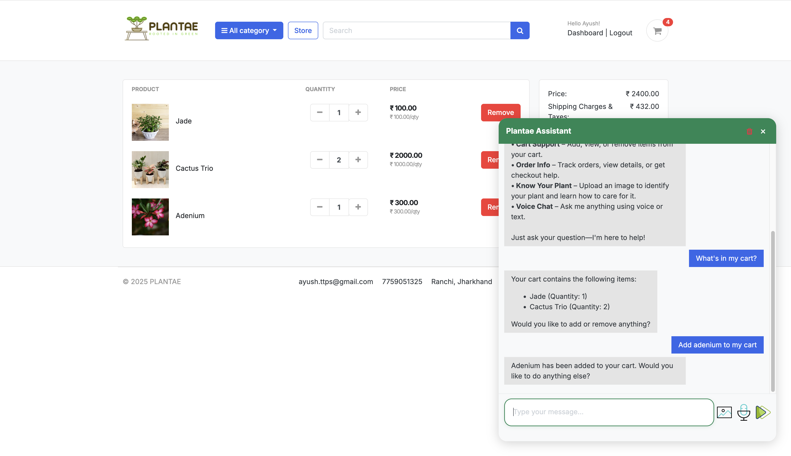
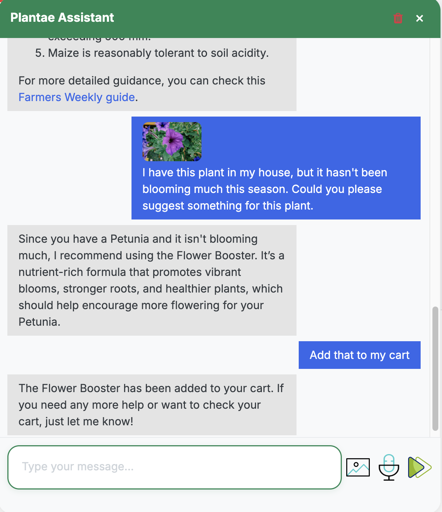
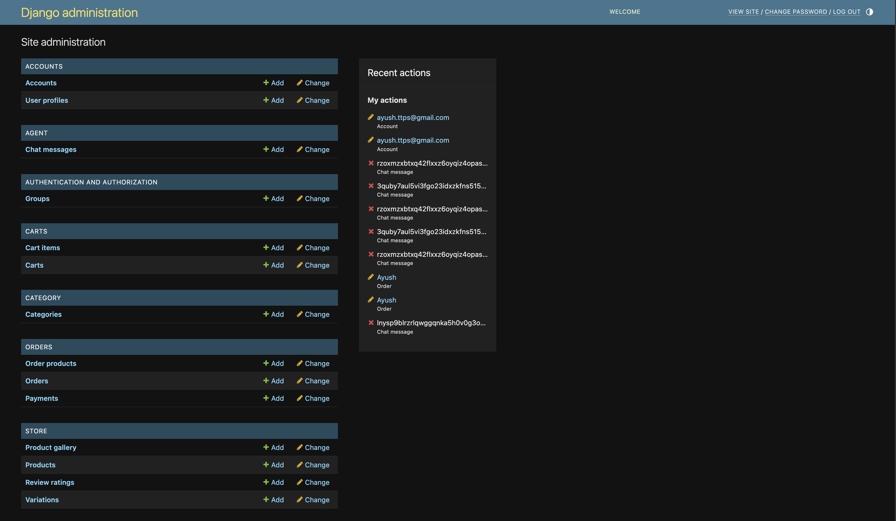
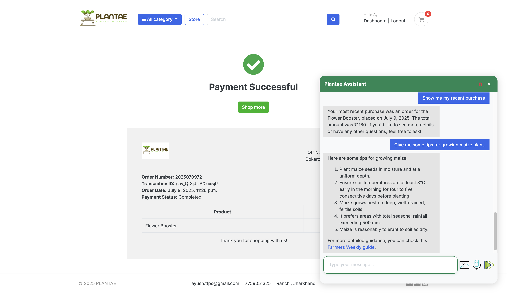

# Plantae 🌱

[](LICENSE)

---

## Live Demo

🌐 **Production:** [https://plantae.live](https://plantae.live)

---

## Table of Contents
- [Overview](#overview)
- [Features](#features)
- [AI Agent Capabilities](#ai-agent-capabilities)
- [Tech Stack](#tech-stack)
- [Directory Structure](#directory-structure)
- [Getting Started](#getting-started)
- [Deployment](#deployment)
- [Screenshots](#screenshots)
- [License](#license)
- [Contact](#contact)

---

## Overview

**Plantae** is a modern, AI-powered e-commerce platform for plant and gardening products. It features a conversational agent for plant care, product recommendations, and order support. The project is built with Django and deployed on an Azure VM at [plantae.live](https://plantae.live).

---

## Features

- **User Authentication:** Register, login, logout, email verification, password reset, profile management.
- **Product Catalog:** Browse, search, and filter products by category, price, and keyword.
- **Product Details:** Detailed product pages with images, plant care info, reviews, and variations.
- **Cart & Checkout:** Add/remove products, manage variations, view cart, checkout with tax calculation.
- **Order Management:** Place orders, view order history, order details, payment via Razorpay, order confirmation emails.
- **Reviews:** Submit and update product reviews.
- **Admin Panel:** Manage users, products, categories, orders, and chat limits.
- **UI:** Modern design with Bootstrap and custom CSS.
- **AI Assistant:** Chatbot for plant care, product help, and order support.

---

## AI Agent Capabilities

- **Conversational Assistant:**
  - Accessible via chat widget (for logged-in users)
  - Handles plant care queries, product recommendations, order status, and cart management
  - Supports text and image-based queries (can identify plants from images)
  - Multilingual (English/Hindi)
  - Rate-limited (max 10 messages per user)
- **Voice Features:**
  - Text-to-Speech (TTS) and Speech-to-Text (STT) using ElevenLabs
- **Agent Modules:**
  - **Supervisor Agent:** Routes queries to the correct sub-agent(s) using LLM-based classification
  - **Cart Agent:** Add/view/remove items in cart
  - **Order Agent:** Fetch order details, order history, redirect to checkout and my orders links
  - **Research Agent:** Plant care, diseases, watering, sunlight, etc.
  - **Recommendation Agent:** Suggests products based on user needs and catalog
  
---

## Tech Stack

- **Backend:** Django 4.2 (Python)
- **Frontend:** Django Templates, Bootstrap, jQuery, FontAwesome
- **AI/Agent:** LangChain, OpenAI, LangGraph, ElevenLabs (TTS/STT)
- **Database:** SQLite (default, can be swapped)
- **Payments:** Razorpay
- **Other:** dotenv, crispy-forms, admin-thumbnails, etc.

See [`requirements.txt`](requirements.txt) for full dependency list.

---

## Directory Structure

```
plantae/
├── accounts/      # User authentication, registration, profile, dashboard
├── agent/         # AI/LLM agent logic, chat history, endpoints for chat, TTS, STT
├── carts/         # Cart and cart item models, add/remove/update cart logic, checkout
├── category/      # Product categories, category listing, context processors
├── orders/        # Order placement, payment integration, order history, order details
├── store/         # Product models, variations, reviews, product gallery, search
├── templates/     # All HTML templates for pages, emails, includes (navbar, footer, chat widget, etc.)
├── static/        # CSS, JS, images, fonts, and other static assets
├── plantae/       # Project settings, URLs, static/media config, main entry points
├── manage.py      # Django management script
├── requirements.txt
└── ...
```

---

## Getting Started

1. **Clone the repo:**
   ```bash
   git clone https://github.com/yourusername/plantae.git
   cd plantae
   ```
2. **Install dependencies:**
   ```bash
   pip install -r requirements.txt
   ```
3. **Set up environment variables:**
   - Copy `.env-sample` to `.env` and fill in your secrets.
4. **Run migrations:**
   ```bash
   python manage.py migrate
   ```
5. **Create superuser:**
   ```bash
   python manage.py createsuperuser
   ```
6. **Run the server:**
   ```bash
   python manage.py runserver
   ```
7. **Access:**
   - Website: [http://127.0.0.1:8000/](http://127.0.0.1:8000/)
   - Admin: [http://127.0.0.1:8000/admin/](http://127.0.0.1:8000/admin/)

---

## Deployment

- **Production:** Deployed on an Azure VM
- **Domain:** [https://plantae.live](https://plantae.live)
- **Static & Media:** Served via Django static/media settings
- **Environment:** Python 3.10+, pip, virtualenv recommended

---

## Screenshots

- 
*Home Page*
- 
*Store Page*
- 
*Product Detail Page*
- 
*Cart Page*
- 
*Chat Widget*
- 
*Admin Page*
- 

---

## License

This project is licensed under the [MIT License](LICENSE).

---

## Contact

- **Email:** ayush.ttps@gmail.com
- **Location:** Ranchi, Jharkhand

---

> _Pull requests are welcome! Please open an issue first to discuss changes._ 