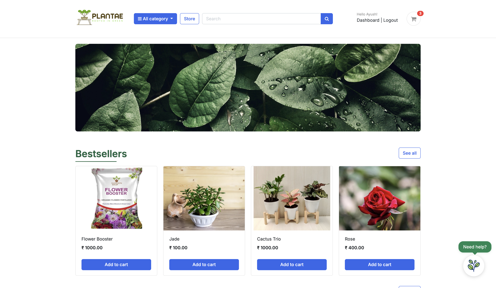
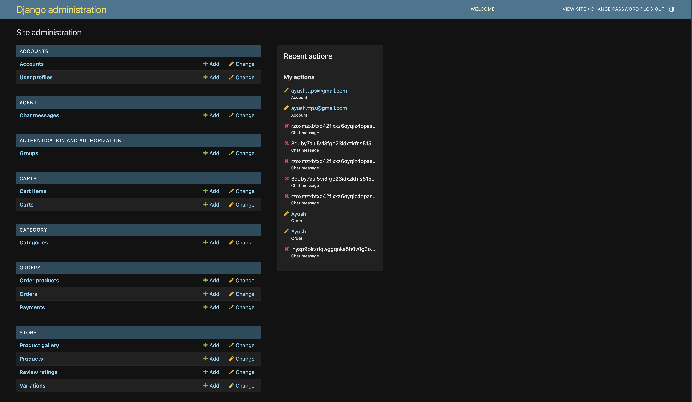
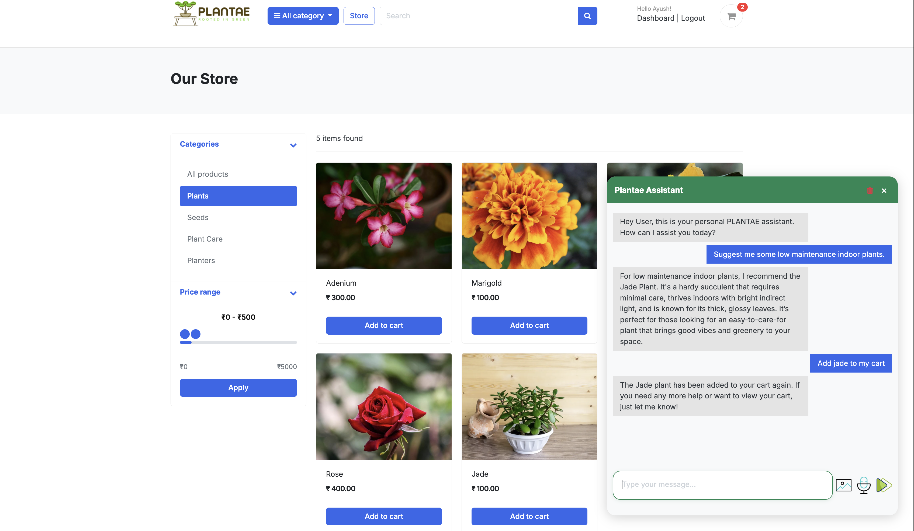
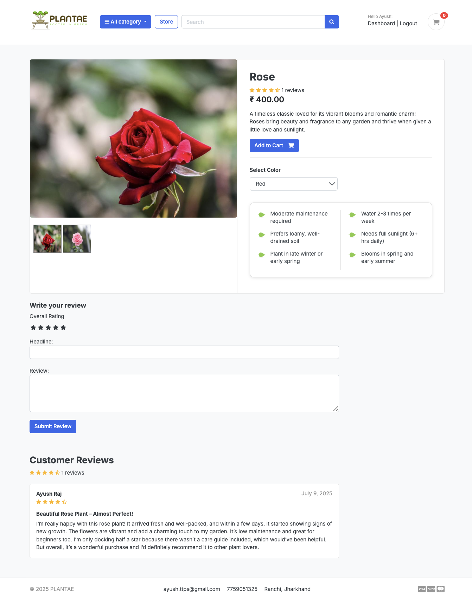
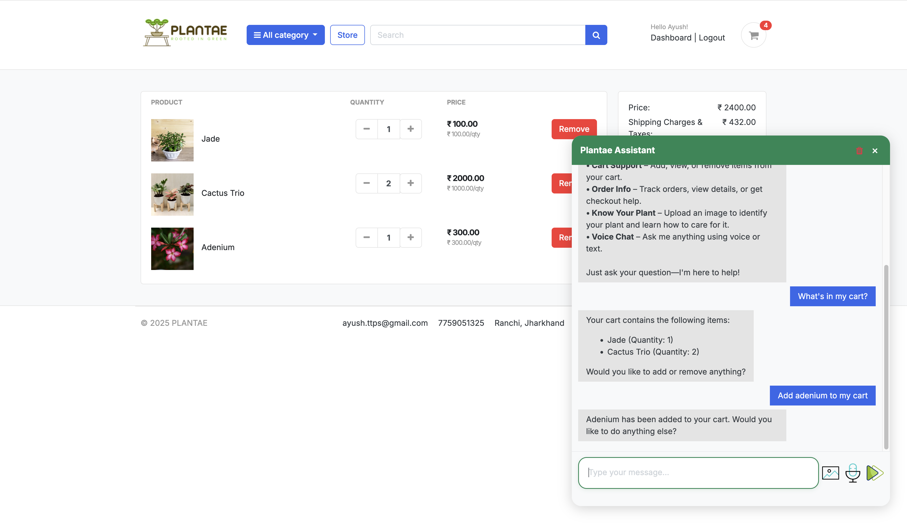
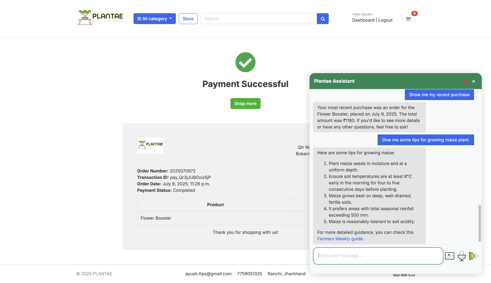
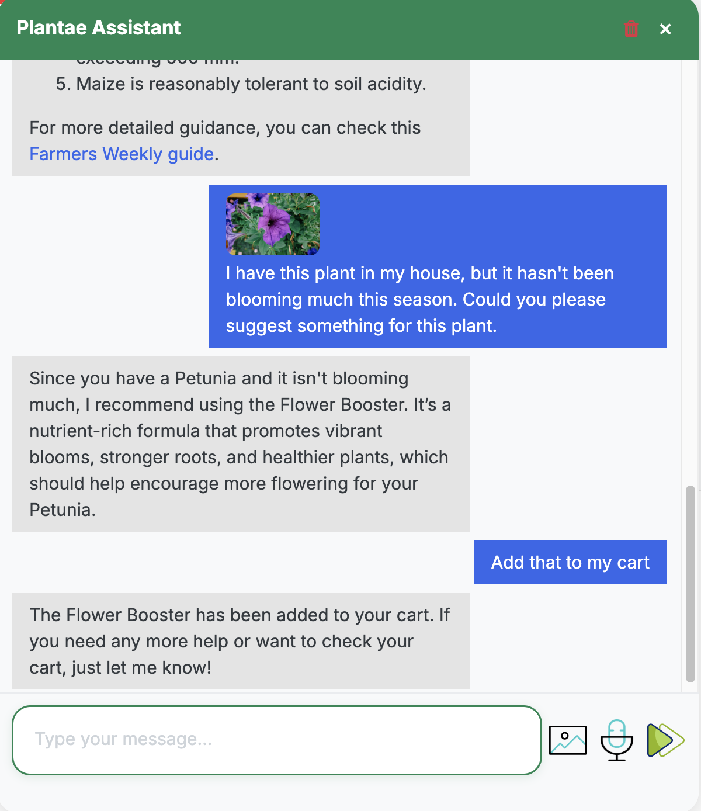
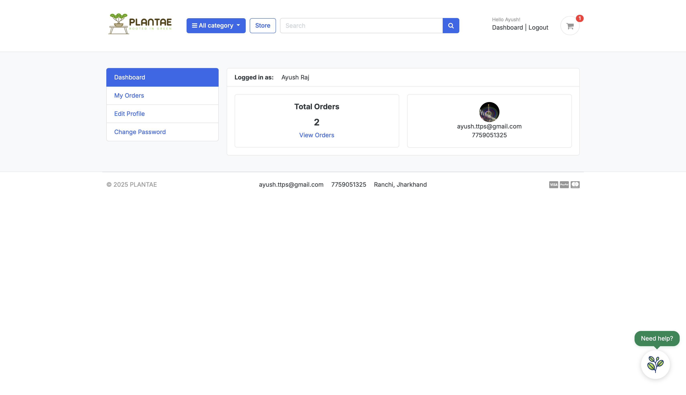
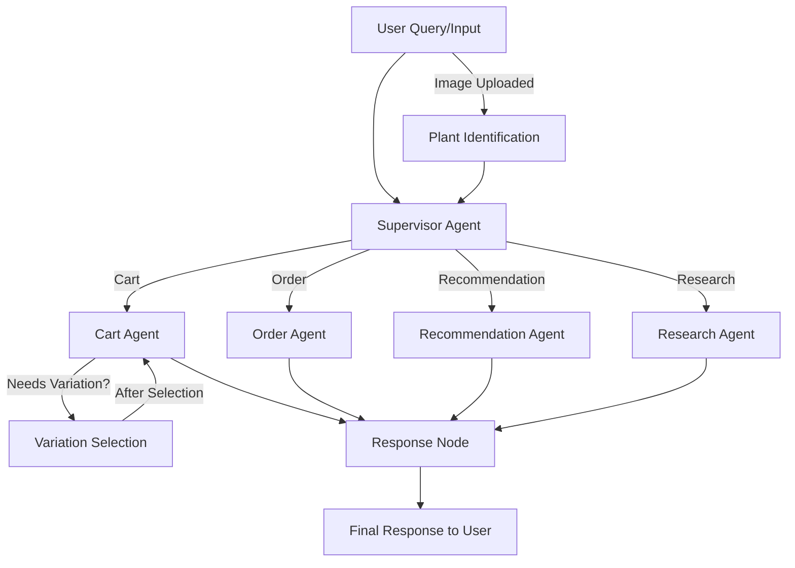

# Plantae 🌱

<p align="center">
  
</p>

[](LICENSE)

---

## Live Demo

🌐 **Production:** [https://plantaeai.tech](https://plantaeai.tech)

---

## Table of Contents
- [Overview](#overview)
- [Screenshots](#screenshots)
- [Features](#features)
- [AI Agent & Workflow](#ai-agent--workflow)
- [App Structure](#app-structure)
- [Tech Stack](#tech-stack)
- [Getting Started](#getting-started)
- [Load Test Analysis](#load-test-analysis)
- [Deployment](#deployment)
- [License](#license)
- [Contact](#contact)

---

## Overview

**Plantae** is a modern, AI-powered e-commerce platform for plant and gardening products. It features a conversational agent for plant care, product recommendations, and order support. The project is built with Django and deployed on an Azure VM at [plantaeai.tech](https://plantaeai.tech).

---

## Screenshots

| Home Page | Admin |
|-----------|-------|
|  | |

| Store | Product Detail |
|-------|---------------|
|  |  |

| Cart | Payment Success |
|------|----------------|
|  |  |

| Chat Widget | Dashboard |
|-------------|-----------|
|  |  |

---

## Features

- **User Authentication:** Register, login, logout, email verification, password reset, profile management.
- **Product Catalog:** Browse, search, and filter products by category, price, and keyword.
- **Product Details:** Detailed product pages with images, plant care info, reviews, and variations.
- **Cart & Checkout:** Add/remove products, manage variations, view cart, checkout with tax calculation.
- **Order Management:** Place orders, view order history, order details, payment via Razorpay, order confirmation emails.
- **Reviews:** Submit and update product reviews.
- **Admin Panel:** Manage users, products, categories, orders, and chat limits.
- **Modern UI:** Responsive design with Bootstrap and custom CSS.
- **AI Assistant:** Chatbot for plant care, product help, and order support (text, image, and voice).

---

## AI Agent & Workflow

### Capabilities
- **Conversational Assistant:**
  - Handles plant care queries, product recommendations, order status, and cart management
  - Supports text and image-based queries (can identify plants from images)
  - Multilingual (English/Hindi)
  - Rate-limited (max 10 messages per user)
- **Voice Features:**
  - Text-to-Speech (TTS) and Speech-to-Text (STT) using ElevenLabs
- **Agent Modules:**
  - **Supervisor Agent:** Routes queries to the correct sub-agent(s) using LLM-based classification
  - **Cart Agent:** Add/view/remove items in cart
  - **Order Agent:** Fetch order details, order history, redirect to checkout and my orders links
  - **Research Agent:** Plant care, diseases, watering, sunlight, etc.
  - **Recommendation Agent:** Suggests products based on user needs and catalog

### Simple Workflow Diagram


```mermaid
flowchart TD
    User[User Query/Input] --> Supervisor[Supervisor Agent]
    Supervisor -->|Cart| Cart[Cart Agent]
    Supervisor -->|Order| Order[Order Agent]
    Supervisor -->|Recommendation| Recommendation[Recommendation Agent]
    Supervisor -->|Research| Research[Research Agent]
    Cart -- Needs Variation? --> Variation[Variation Selection]
    Variation -- After Selection --> Cart
    Cart --> Response[Response Node]
    Order --> Response
    Recommendation --> Response
    Research --> Response
    Response --> UserResp[Final Response to User]
    User -- Image Uploaded --> PlantID[Plant Identification]
    PlantID --> Supervisor
    %% Notes:
    %% - Supervisor routes to one agent per query
    %% - Variation selection only for cart
    %% - Plant identification augments user input if image is uploaded
```

---

## App Structure

### 1. Accounts
Handles user authentication, registration, profile management, and user dashboard.
- Custom user model (`Account`) with email as the username.
- User registration, login, logout, and email activation.
- User profile management (`UserProfile`), including address and profile picture.
- Password reset and change, user dashboard, and context processor for user info.

### 2. Agent
AI-powered chat assistant for plant care, shopping, and order support.
- Chat interface for users to interact with the AI assistant.
- Handles plant identification from images using LLMs.
- Supports cart, order, product recommendation, and plant care queries.
- Voice integration (STT/TTS), conversation memory, and rate limiting.
- Admin tools for chat history and chat limit resets.
- See [Detailed Agent Workflow Diagram](agent/README.md#detailed-agent-workflow-diagram) for advanced logic.

### 3. Carts
Manages shopping cart functionality for users (both authenticated and guests).
- Add, remove, and update products in the cart.
- Handles product variations (color, size, etc.).
- Calculates cart totals, tax, and grand total.
- Checkout process integration and cart item count context processor.

### 4. Category
Manages product categories for the store.
- CRUD for product categories (name, slug, description, image).
- Used for filtering and organizing products in the store.
- Context processor for category navigation.

### 5. Orders
Handles order placement, payment, and order history.
- Place orders from cart items, payment via Razorpay.
- Stores order details, shipping address, and payment info.
- Order status tracking, order history, and order detail views.
- Sends order confirmation emails.

### 6. Store
Manages products, product variations, reviews, and the main store interface.
- Product listing, detail, and search.
- Product variations (color, size, pack), reviews, and gallery images.
- Plant care information for products.
- Pagination and price filtering.

---

## Tech Stack

- **Backend:** Django 4.2 (Python)
- **Frontend:** Django Templates, Bootstrap, jQuery, FontAwesome
- **AI/Agent:** LangChain, OpenAI, LangGraph, ElevenLabs (TTS/STT)
- **LLM:** OpenAI's gpt-5.6-luna
- **Database:** Azure Database for PostgreSQL Flexible Server
- **Payments:** Razorpay
- **Other:** dotenv, crispy-forms, admin-thumbnails, etc.

See [`requirements.txt`](requirements.txt) for full dependency list.

---

## Getting Started

1. **Clone the repo:**
   ```bash
   git clone https://github.com/ayushraj09/plantae.git
   cd plantae
   ```
2. **Install dependencies:**
   ```bash
   pip install -r requirements.txt
   ```
3. **Set up environment variables:**
   - Copy `.env-sample` to `.env` and fill in your secrets.
4. **Run migrations:**
   ```bash
   python manage.py migrate
   ```
5. **Create superuser:**
   ```bash
   python manage.py createsuperuser
   ```
6. **Run the server:**
   ```bash
   python manage.py runserver
   ```
7. **Access:**
   - Website: [http://127.0.0.1:8000/](http://127.0.0.1:8000/)
   - Admin: [http://127.0.0.1:8000/admin/](http://127.0.0.1:8000/admin/)

---

## Load Test Analysis

Load testing was performed with Locust using the scenario in [`locust_loadtest/locustfile.py`](locust_loadtest/locustfile.py). The suite mixes three weighted user types against production: anonymous browsers (weight 4), authenticated customers who log in and exercise cart/checkout paths (weight 3), and a cart-profiling user that hammers `add_cart` (weight 1). Each page load also fetches its referenced static and media assets, mirroring real browser traffic.

### Test Coverage

- **Anonymous browse:** `GET /`, `/store/`, `/store/category/plants/`, `/store/search/`, product detail pages
- **Authenticated journey:** login, dashboard, my orders, browse, `POST /cart/add_cart/{id}/`, cart view, checkout page
- **Cart profiling:** repeated `POST /cart/add_cart/{id}/`, cart and checkout reads
- **Static/media:** up to 12 referenced assets per page (`/static/…`, `/media/…`)

Order-placement POSTs were left disabled in both runs so no test orders were written to the production database.

### Run 1 — Baseline (50 users)

50 concurrent users, spawn rate 5/s, 3-minute run.

| Metric | Result |
|--------|--------|
| Peak users | 50 |
| Total requests | 8,351 |
| Total failures | 5 |
| Failure rate | 0.06% |
| Average throughput | 46.7 requests/second |
| Aggregate median response time | 44 ms |
| Aggregate 95th percentile | 3,300 ms |
| Aggregate 99th percentile | 6,200 ms |
| Maximum response time | 7,597 ms |

The aggregate median is dominated by the ~7,400 static/media requests, which Apache served in 42-43 ms. Dynamic Django views told a very different story:

- **Static and media assets held up well:** 42-43 ms median across all asset types, 95th percentile between 55 and 360 ms, zero failures.
- **Dynamic pages degraded:** home, store, category, product detail, and search all sat at a 2,800-3,000 ms median. Authenticated dashboard and my-orders pages were 2,600-2,700 ms. Login POST was 2,000 ms.
- **Cart writes were the worst path:** `POST /cart/add_cart/{id}/` had a 6,000-6,200 ms median, roughly 2x any read path.
- **5 failures:** four `RemoteDisconnected` errors and one `403` from a stale CSRF token on a retried cart-add POST.

### Run 2 — Stress (200 users)

200 concurrent users, spawn rate 10/s, 3-minute run.

| Metric | Result |
|--------|--------|
| Peak users | 200 |
| Total requests | 11,209 |
| Total failures | 591 |
| Failure rate | 5.27% |
| Average throughput | 62.6 requests/second |
| Aggregate median response time | 52 ms |
| Aggregate 90th percentile | 12,000 ms |
| Aggregate 99th percentile | 19,000 ms |
| Maximum response time | 30,880 ms |

Quadrupling the user count barely moved throughput (46.7 → 62.6 req/s) while latency and errors collapsed:

- **Dynamic pages:** ~13,000 ms median across every browse and account view.
- **Cart writes:** 25,000-31,000 ms median on `add_cart` POSTs.
- **Responses capped near 31 s**, indicating a proxy/Gunicorn timeout ceiling rather than eventual completion.
- **591 failures (5.27%):** mostly `RemoteDisconnected` as the server dropped connections; the auth path itself began failing (23 failed logins, 10 unreachable dashboards), and CSRF-dependent cart POSTs 403'd because the page that carries the token never loaded.

### Run 3 — Anonymous-only capacity sweep

Anonymous browse journey only (no login), 90 s per level, spawn rate 20/s.

| Concurrent users | Failure rate | Successful requests |
|--------|--------|--------|
| 100 | 0.43% | 99.57% |
| 150 | 0.63% | 99.37% |
| 200 | 17.24% | 82.76% |
| 250 | 23.03% | 76.97% |
| 500 | 27.28% | 72.72% |

**~150 concurrent unauthenticated users** is the ceiling for a healthy service (>99% success). Between 150 and 200 the site falls off a cliff as Gunicorn's queue overflows and connections are dropped; past 250, throughput drops while errors climb.

### Conclusion

The server handles **~150 concurrent unauthenticated browsers** or **~50 concurrent authenticated customers** before failures climb. Dynamic Django throughput is capped at **~15-20 requests/second** regardless of load — consistent with a small Gunicorn worker pool where each database-writing request holds a worker for seconds. Beyond those limits, added concurrency produces queueing and timeouts, not more work done. The bottleneck is not the network: static assets from the same host returned in ~43 ms across every run.

Raw Locust result files are in [`locust_loadtest/`](locust_loadtest/) (`plantae_loadtest_*` for the baseline, `plantae_stress_*` for the stress run), with full HTML reports at [`plantae_loadtest_report.html`](locust_loadtest/plantae_loadtest_report.html) and [`plantae_stress_report.html`](locust_loadtest/plantae_stress_report.html).

---

## Deployment

- **Production:** Deployed on an Azure VM
- **Domain:** [https://plantaeai.tech](https://plantaeai.tech)
- **Static & Media:** Served via Django static/media settings
- **Environment:** Python 3.11, pip, virtualenv recommended

---

## License

This project is licensed under the [MIT License](LICENSE).

---

## Contact

- **Email:** ayush.ttps@gmail.com

---

> _Pull requests are welcome! Please open an issue first to discuss changes._ 
