# Plantae 🌱

<p align="center">
  
</p>

[](LICENSE)

---

## Live Demo

🌐 **Production:** [https://plantae.live](https://plantae.live)

---

## Table of Contents
- [Overview](#overview)
- [Screenshots](#screenshots)
- [Features](#features)
- [AI Agent & Workflow](#ai-agent--workflow)
- [App Structure](#app-structure)
- [Tech Stack](#tech-stack)
- [Getting Started](#getting-started)
- [Deployment](#deployment)
- [License](#license)
- [Contact](#contact)

---

## Overview

**Plantae** is a modern, AI-powered e-commerce platform for plant and gardening products. It features a conversational agent for plant care, product recommendations, and order support. The project is built with Django and deployed on an Azure VM at [plantae.live](https://plantae.live).

---

## Screenshots

| Home Page | Admin |
|-----------|-------|
|  | |

| Store | Product Detail |
|-------|---------------|
|  |  |

| Cart | Payment Success |
|------|----------------|
|  |  |

| Chat Widget | Dashboard |
|-------------|-----------|
|  |  |

---

## Features

- **User Authentication:** Register, login, logout, email verification, password reset, profile management.
- **Product Catalog:** Browse, search, and filter products by category, price, and keyword.
- **Product Details:** Detailed product pages with images, plant care info, reviews, and variations.
- **Cart & Checkout:** Add/remove products, manage variations, view cart, checkout with tax calculation.
- **Order Management:** Place orders, view order history, order details, payment via Razorpay, order confirmation emails.
- **Reviews:** Submit and update product reviews.
- **Admin Panel:** Manage users, products, categories, orders, and chat limits.
- **Modern UI:** Responsive design with Bootstrap and custom CSS.
- **AI Assistant:** Chatbot for plant care, product help, and order support (text, image, and voice).

---

## AI Agent & Workflow

### Capabilities
- **Conversational Assistant:**
  - Handles plant care queries, product recommendations, order status, and cart management
  - Supports text and image-based queries (can identify plants from images)
  - Multilingual (English/Hindi)
  - Rate-limited (max 10 messages per user)
- **Voice Features:**
  - Text-to-Speech (TTS) and Speech-to-Text (STT) using ElevenLabs
- **Agent Modules:**
  - **Supervisor Agent:** Routes queries to the correct sub-agent(s) using LLM-based classification
  - **Cart Agent:** Add/view/remove items in cart
  - **Order Agent:** Fetch order details, order history, redirect to checkout and my orders links
  - **Research Agent:** Plant care, diseases, watering, sunlight, etc.
  - **Recommendation Agent:** Suggests products based on user needs and catalog

### Simple Workflow Diagram

```mermaid
flowchart TD
    User[User Query/Input] --> Supervisor[Supervisor Agent]
    Supervisor -->|Cart| Cart[Cart Agent]
    Supervisor -->|Order| Order[Order Agent]
    Supervisor -->|Recommendation| Recommendation[Recommendation Agent]
    Supervisor -->|Research| Research[Research Agent]
    Cart -- Needs Variation? --> Variation[Variation Selection]
    Variation -- After Selection --> Cart
    Cart --> Response[Response Node]
    Order --> Response
    Recommendation --> Response
    Research --> Response
    Response --> UserResp[Final Response to User]
    User -- Image Uploaded --> PlantID[Plant Identification]
    PlantID --> Supervisor
    %% Notes:
    %% - Supervisor routes to one agent per query
    %% - Variation selection only for cart
    %% - Plant identification augments user input if image is uploaded
```



---

## App Structure

### 1. Accounts
Handles user authentication, registration, profile management, and user dashboard.
- Custom user model (`Account`) with email as the username.
- User registration, login, logout, and email activation.
- User profile management (`UserProfile`), including address and profile picture.
- Password reset and change, user dashboard, and context processor for user info.

### 2. Agent
AI-powered chat assistant for plant care, shopping, and order support.
- Chat interface for users to interact with the AI assistant.
- Handles plant identification from images using LLMs.
- Supports cart, order, product recommendation, and plant care queries.
- Voice integration (STT/TTS), conversation memory, and rate limiting.
- Admin tools for chat history and chat limit resets.
- See [Detailed Agent Workflow Diagram](agent/README.md#detailed-agent-workflow-diagram) for advanced logic.

### 3. Carts
Manages shopping cart functionality for users (both authenticated and guests).
- Add, remove, and update products in the cart.
- Handles product variations (color, size, etc.).
- Calculates cart totals, tax, and grand total.
- Checkout process integration and cart item count context processor.

### 4. Category
Manages product categories for the store.
- CRUD for product categories (name, slug, description, image).
- Used for filtering and organizing products in the store.
- Context processor for category navigation.

### 5. Orders
Handles order placement, payment, and order history.
- Place orders from cart items, payment via Razorpay.
- Stores order details, shipping address, and payment info.
- Order status tracking, order history, and order detail views.
- Sends order confirmation emails.

### 6. Store
Manages products, product variations, reviews, and the main store interface.
- Product listing, detail, and search.
- Product variations (color, size, pack), reviews, and gallery images.
- Plant care information for products.
- Pagination and price filtering.

---

## Tech Stack

- **Backend:** Django 4.2 (Python)
- **Frontend:** Django Templates, Bootstrap, jQuery, FontAwesome
- **AI/Agent:** LangChain, OpenAI, LangGraph, ElevenLabs (TTS/STT)
- **Database:** SQLite (default, can be swapped)
- **Payments:** Razorpay
- **Other:** dotenv, crispy-forms, admin-thumbnails, etc.

See [`requirements.txt`](requirements.txt) for full dependency list.

---

## Getting Started

1. **Clone the repo:**
   ```bash
   git clone https://github.com/ayushraj09/plantae.git
   cd plantae
   ```
2. **Install dependencies:**
   ```bash
   pip install -r requirements.txt
   ```
3. **Set up environment variables:**
   - Copy `.env-sample` to `.env` and fill in your secrets.
4. **Run migrations:**
   ```bash
   python manage.py migrate
   ```
5. **Create superuser:**
   ```bash
   python manage.py createsuperuser
   ```
6. **Run the server:**
   ```bash
   python manage.py runserver
   ```
7. **Access:**
   - Website: [http://127.0.0.1:8000/](http://127.0.0.1:8000/)
   - Admin: [http://127.0.0.1:8000/admin/](http://127.0.0.1:8000/admin/)

---

## Deployment

- **Production:** Deployed on an Azure VM
- **Domain:** [https://plantae.live](https://plantae.live)
- **Static & Media:** Served via Django static/media settings
- **Environment:** Python 3.11, pip, virtualenv recommended

---

## License

This project is licensed under the [MIT License](LICENSE).

---

## Contact

- **Email:** ayush.ttps@gmail.com

---

> _Pull requests are welcome! Please open an issue first to discuss changes._ 
