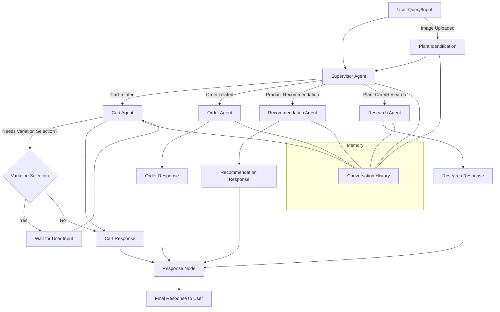

# Agent App

## Purpose
The `agent` app powers the AI-driven chat assistant for the Plantae platform. It enables users to interact with a smart assistant for plant care, shopping, order support, and more, using both text and images. The app leverages advanced LLMs, image recognition, and integrates with other Plantae modules for a seamless user experience.

## Main Features
- **AI Chat Assistant**: Users can chat with an AI agent for plant care, shopping, and order queries.
- **Plant Identification**: Users can upload plant images; the agent identifies the plant using an LLM and provides care or shopping recommendations.
- **Cart, Order, and Product Support**: The agent can help users manage their cart, view orders, and get product recommendations.
- **Voice Integration**: Supports speech-to-text (STT) and text-to-speech (TTS) via ElevenLabs.
- **Conversation Memory**: Remembers previous interactions for context-aware responses.
- **Rate Limiting**: Limits users to 10 messages per session to prevent abuse.
- **Admin Tools**: Admins can view chat histories and reset user chat limits.

## Architecture & Logic
- **Agent Routing**: The core logic (in `langgraph/agent.py`) uses a supervisor agent to route user queries to specialized sub-agents:
  - **Cart Agent**: Handles cart operations (add/view/remove items).
  - **Order Agent**: Handles order history, order details, and status.
  - **Recommendation Agent**: Suggests products based on user needs or identified plants.
  - **Research Agent**: Answers plant care, watering, sunlight, and general plant questions.
- **Image Handling**: Uploaded images are resized, stored, and analyzed for plant identification using OpenAI's API.
- **Interrupts & Human-in-the-Loop**: For product variations, the agent can pause and request user input before proceeding.
- **Memory**: Uses in-memory checkpointing for short-term conversation memory.

## Key Models
- **ChatMessage**: Stores each chat message (user/agent, timestamp, role).
- **ChatImage**: Stores images uploaded in chat, linked to the user.

## Key Views (agent/views.py)
- `chat_interface`: Renders the chat UI for users.
- `ask_agent`: Main endpoint for chat queries, image uploads, and agent logic.
- `greet_agent`: Sends a personalized greeting message.
- `stt`, `tts`: Endpoints for speech-to-text and text-to-speech.
- `handle_variation_selection`: Handles user input for product variations.

## Agent Logic (langgraph/agent.py)
- **Supervisor Agent**: Decides which sub-agent should handle the user's query.
- **Sub-Agents**:
  - Cart, Order, Recommendation, Research (see above).
- **Plant Identification**: Uses OpenAI's API to analyze uploaded images and extract plant names.
- **Product Recommendation**: Suggests products based on plant type or user query.
- **Variation Selection**: If a product requires user-selected variations (e.g., color/size), the agent interrupts and waits for user input.
- **Conversation History**: Maintains per-user conversation history for context.

## Integrations
- **OpenAI**: For LLM-based chat and image analysis.
- **ElevenLabs**: For speech-to-text and text-to-speech.
- **Other Plantae Apps**: Integrates with `accounts`, `store`, `carts`, and `orders` for user, product, cart, and order data.

## Admin
- **Chat History**: Admins can view recent chat messages per user.
- **Reset Chat Limits**: Admin action to reset user chat message limits.

## API Endpoints (urls.py)
- `/ask/`: Main chat endpoint.
- `/clear_chat/`: Clears chat history for a user.
- `/get_chat_history/`: Fetches chat history.
- `/stt/`, `/tts/`: Speech endpoints.
- `/greet/`: Sends a greeting message.
- `/variation_selection/`: Handles product variation selection.

## Templates
- `agent/chat.html`: Main chat interface for users.

## Security & Rate Limiting
- Only authenticated users can access chat features.
- Each user is limited to 10 messages per session; admins can reset this limit.

## Extensibility
- The agent logic is modular and can be extended with new tools, sub-agents, or integrations.
- Designed for easy integration with new LLMs or APIs.

## Notes
- The app is central to the Plantae user experience, providing smart, context-aware, and multimodal (text/image/voice) support.
- For more details, see the code in `langgraph/agent.py` and `views.py`. 

# Detailed Agent Workflow Diagram

