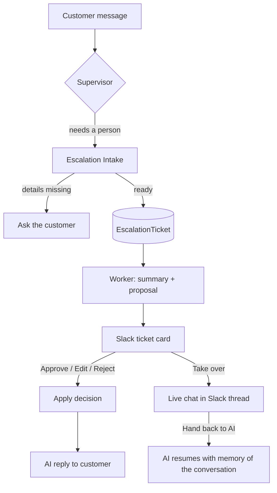

# Agent App

## Purpose
The `agent` app powers the AI chat assistant for Plantae: plant care, shopping, and order support through text, images, and voice. When a request needs a person, it escalates to the Plantae team on Slack (human-in-the-loop) and keeps the customer informed in the same chat.

## Main Features
- **AI Chat Assistant**: plant care, product recommendations, cart and order help.
- **Plant Identification**: identifies plants from uploaded photos and tailors advice.
- **Cart, Order, and Product Support**: view/add/remove cart items (with quantities and variations), look up orders, recommend products.
- **Voice Integration**: speech-to-text (STT) and text-to-speech (TTS) via ElevenLabs.
- **Conversation Memory**: stored in PostgreSQL through the LangGraph checkpointer, so it survives restarts and deploys.
- **Human-in-the-Loop**: escalations to Slack, where staff approve, edit, reject, or take over the chat.
- **Starter Suggestions**: quick-reply buttons at the start of a chat.
- **Rate Limiting**: 10 AI messages per user (messages to staff during a takeover are not counted).
- **Admin Tools**: chat history, agent errors, and escalation tickets with full history.

## Architecture & Logic

### Chat graph (`langgraph/agent.py`, thread `user_<id>`)
The **supervisor** classifies every message (structured output, with the last few messages as context) and routes it to one node:

| Route | Node | Handles |
|---|---|---|
| `cart` | Cart Agent | View/add/remove items, quantities, variation picker |
| `order` | Order Agent | Order details, history, checkout and My Orders links |
| `recommendation` | Recommendation | Products from the catalog, or for an identified plant |
| `research` | Research Agent | Plant care via web search |
| `general` | General Agent | Greetings, thanks, follow-ups about the conversation; politely declines off-topic requests |
| `escalation` | Escalation Intake | Requests that need a person (see below) |

Some messages skip the LLM and go straight to escalation: asking for a human ("talk to a person", "customer care"), two errors in a row, or the same question asked three times. An angry customer is handed to a person immediately.

The **variation picker** pauses the graph (`interrupt`) until the customer chooses a color/size, then adds the item.

### Escalation intake (`langgraph/escalation.py`)
1. Picks a category: `price_match`, `cancellation`, `delivery`, `payment_issue`, `damaged_item`, `bulk_order`, `complaint`, `human_request`, `other`.
2. Extracts the details staff need (product, competitor price and source, order number, amount, ...) and asks the customer for anything missing (at most twice). The customer can withdraw ("never mind").
3. Opens an `EscalationTicket`:
   - **assist** (price match, cancellation, delivery, payment): staff approve or edit an AI proposal.
   - **takeover** (damaged item, bulk order, complaint, asked for a human, angry customer): staff chat with the customer directly.

### Escalation graph (thread `esc_<ticket_id>`, runs in the worker)
```
prepare_proposal ─► staff_review (interrupt) ─► apply_decision ─► compose_reply
```
- `prepare_proposal` writes a staff summary and a rule-based proposal from the database (e.g. price gap → discount %, capped at 15%; an "Accepted" order → cancel it).
- `staff_review` pauses until a staff decision arrives from Slack or the admin.
- `apply_decision` performs the approved action (`hitl/actions.py`): cancel the order, or create a **price-match coupon**.
- `compose_reply` writes the customer message from the outcome and staff note, without inventing promises, and adds it to the chat memory.

The escalation runs on its own thread so the customer can keep chatting while staff decide.

### Human-in-the-loop flow

```mermaid
flowchart TD
    U[Customer message] --> S{Supervisor}
    S -->|needs a person| I[Escalation Intake]
    I -->|details missing| Q[Ask the customer]
    I -->|ready| T[(EscalationTicket)]
    T --> W[Worker: summary + proposal]
    W --> SL[Slack ticket card]
    SL -->|Approve / Edit / Reject| D[Apply decision]
    D --> R[AI reply to customer]
    SL -->|Take over| TO[Live chat in Slack thread]
    TO -->|Hand back to AI| AI[AI resumes with memory of the conversation]
```

### Price-match coupons
An approved price match creates a `carts.Coupon` (e.g. `ROSE10`):
- tied to the **customer's account** and the **product**; lookups always include the logged-in user;
- covers up to **2 units** per order, valid **7 days**, **single use**, consumed only after Razorpay confirms payment;
- entered in the coupon box on the cart or checkout page; totals are computed in one place (`carts/pricing.py`).

### Live updates in the widget
While a ticket is open, the chat widget polls `/agent/updates/` every 8 seconds for staff messages and AI replies, shows a banner ("You're chatting with the Plantae team"), and stops once the outcome has been delivered.

## Key Models
- **ChatMessage**: each chat message (`user`, `agent`, or `staff`), linked to a ticket and staff author when relevant.
- **ChatImage**: images uploaded in chat.
- **AgentError**: failures recorded for the admin panel.
- **EscalationTicket**: category, mode (assist/takeover), status, summary, details, proposal, final decision, Slack thread, assignee.
- **TicketEvent**: audit trail for every ticket (created, posted, approved, edited, rejected, takeover, messages, hand-back, reminders).

## Code Layout
- `langgraph/agent.py`: chat graph, supervisor, sub-agents.
- `langgraph/escalation.py`: escalation intake and escalation graph.
- `langgraph/checkpointer.py`: PostgreSQL checkpointer (`python manage.py setup_checkpointer` creates its tables).
- `langgraph/tools.py`: cart/order/product tools (fuzzy product matching, quantities).
- `hitl/service.py`: ticket lifecycle (create, decide, take over, hand back, relay messages).
- `hitl/actions.py`: what an approved decision does (cancel order, create coupon).
- `hitl/slack.py`, `views_slack.py`: Slack cards, buttons, edit dialogs, signed webhooks.
- `hitl/tasks.py`: background jobs run by `python manage.py qcluster`.
- `hitl/notify.py`: email fallback.

## API Endpoints (urls.py)
- `/ask/`: main chat endpoint (relays to staff during a takeover).
- `/updates/`: new staff/AI messages and ticket status (polled by the widget).
- `/escalate/`: "Talk to a human" button.
- `/slack/interactions/`, `/slack/events/`: Slack buttons/dialogs and thread replies (verified by Slack signature).
- `/clear_chat/`, `/get_chat_history/`, `/greet/`, `/stt/`, `/tts/`, `/variation_selection/`.

## Admin
- **Chat History**: recent messages per user.
- **Agent Errors**: failures with tracebacks, mark as resolved.
- **Escalation Tickets**: summary, details, proposal, recent chat, history; decide (approve / edit / reject / take over / hand back) and reply to the customer without Slack.

## Security & Rate Limiting
- Only authenticated users can chat; Slack webhooks are accepted only with a valid Slack signature.
- Database changes from escalations happen only after a staff decision.
- Agents never reveal internal IDs or create discount codes on their own.
- 10 AI messages per user; users with an open ticket are never blocked from reaching staff.

## Slack Screenshots
**Ticket card**


**Live chat in a thread**


